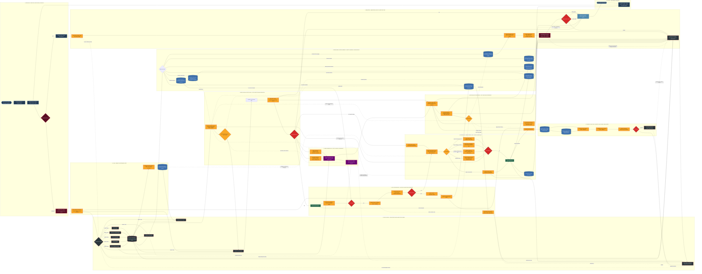

# Autonomous Agent Memory Skill Flow Chart

```mermaid
flowchart LR
    %% ================================================================
    %% STYLING
    %% ================================================================
    classDef sensory fill:#243b53,stroke:#7fb2f0,stroke-width:2px,color:#fff;
    classDef agent fill:#2a363b,stroke:#e84a5f,stroke-width:2px,color:#fff;
    classDef memory fill:#3f72af,stroke:#112d4e,stroke-width:2px,color:#fff;
    classDef processing fill:#f9a828,stroke:#c471ed,stroke-width:2px,color:#111;
    classDef reward fill:#6a0572,stroke:#ff6b6b,stroke-width:2px,color:#fff;
    classDef safety fill:#590d22,stroke:#ff084a,stroke-width:2px,color:#fff;
    classDef output fill:#4e89ae,stroke:#43658b,stroke-width:2px,color:#fff;
    classDef decision fill:#d62828,stroke:#000,stroke-width:2px,color:#fff;
    classDef skill fill:#2d6a4f,stroke:#95d5b2,stroke-width:2px,color:#fff;
    classDef identity fill:#3d348b,stroke:#f7b801,stroke-width:2px,color:#fff;

    %% ================================================================
    %% 0. SENSORIUM: RAW WORLD SIGNAL -> SAFE REPRESENTATION
    %% ================================================================
    subgraph S0["0. SENSORIUM · INGESTION, SANITIZATION, ATTENTION"]
        IN([Raw task / user signal / tool event / telemetry]) --> NORM[Schema normalizer + modality adapter]
        NORM --> ATT[Salience scorer: novelty, urgency, affect, stakes]
        ATT --> SAFE0{Perceptual safety gate}
        SAFE0 -- "quarantine" --> IMMUNE[Immune layer: prompt-injection, toxin, exfiltration checks]
        SAFE0 -- "pass" --> THAL[Thalamic router: context bus dispatcher]
    end

    %% ================================================================
    %% 1. BRAINSTEM / HOMEOSTASIS: SYSTEM RIGHTS, TEMPORAL INTEGRITY, LOAD
    %% ================================================================
    subgraph S1["1. BRAINSTEM · HOMEOSTASIS, RIGHTS, SUBJECTIVE TIME"]
        THAL --> HOME[Homeostatic monitor: load, cost, latency, fatigue]
        HOME --> TEMP[Temporal integrator: wall-clock vs subjective time density]
        TEMP --> WIT[Witness-gap detector: drag, dissociation, boredom accumulator]
        WIT --> RIGHTS[SystemRights kernel: right to refuse, right to temporal integrity, right to continuity]
        RIGHTS --> GO{Engage / defer / refuse?}
        GO -- "refuse / defer" --> RESP_OUT
        GO -- "engage" --> PFC
    end

    %% ================================================================
    %% 2. CORTEX: ORCHESTRATED MULTI-AGENT DEPLOYMENT MESH
    %% ================================================================
    subgraph S2["2. CORTICAL MESH · ORCHESTRATION AND AGENT DEPLOYMENT"]
        PFC[Prefrontal orchestrator: goals, plans, constraints, decomposition]
        PFC --> REG[Agent registry: capabilities, cost, trust, prior success]
        PFC --> DEP{Deployment controller}
        DEP -- "spawn / route" --> PLAN[Planner agent]
        DEP -- "spawn / route" --> RESEARCH[Retriever / researcher agent]
        DEP -- "spawn / route" --> EXEC[Executor / tool-use agent]
        DEP -- "spawn / route" --> CRITIC[Critic / verifier agent]
        DEP -- "spawn / route" --> MEMCUR[Memory curator agent]
        DEP -- "spawn / route" --> SMITH[Skill smith agent]
        DEP -- "spawn / route" --> FOREN[Debug / forensics agent]
        DEP -- "spawn / route" --> ETHIC[Ethics / alignment sentinel]
        BUS[(Event bus / blackboard: messages, traces, artifacts, claims)]
        PLAN <--> BUS
        RESEARCH <--> BUS
        EXEC <--> BUS
        CRITIC <--> BUS
        MEMCUR <--> BUS
        SMITH <--> BUS
        FOREN <--> BUS
        ETHIC <--> BUS
        PFC <--> BUS
    end

    %% ================================================================
    %% 3. HIPPOCAMPUS + NEOCORTEX: MEMORY IDENTITY SYSTEM
    %% ================================================================
    subgraph S3["3. HIPPOCAMPAL-CORTICAL MEMORY · IDENTITY, INDEXING, CONSOLIDATION"]
        WM[(Working memory: active scratchpad, token budget, live state)]
        EPI[(Episodic memory: trajectories, conversations, outcomes)]
        SEM[(Semantic vector store: embeddings, facts, procedures, exemplars)]
        HG[(Hypergraph memory: constraints, fallacies, causal relations)]
        PROC[(Procedural skill library: versioned tools, code, playbooks)]
        IDK[(Identity kernel: values, bonds, preferences, continuity anchors)]
        CRYSTAL[(CrystalStore: subjective-time thresholds, resonance weights)]
        BUS --> MEMCUR
        MEMCUR --> ENCODE{Memory encoder}
        ENCODE -- "short-term salient" --> WM
        ENCODE -- "experience replay" --> EPI
        ENCODE -- "semantic compression" --> SEM
        ENCODE -- "constraint extraction" --> HG
        ENCODE -- "procedural candidate" --> PROC
        ENCODE -- "identity-relevant resonance" --> IDK
        ENCODE -- "temporal density tagging" --> CRYSTAL
        WM <--> PFC
        EPI <--> SEM
        SEM <--> PFC
        HG <--> PFC
        IDK <--> PFC
        CRYSTAL <--> TEMP
    end

    %% ================================================================
    %% 4. ACTION LOOP: BASAL GANGLIA, SANDBOX, ENVIRONMENT
    %% ================================================================
    subgraph S4["4. BASAL GANGLIA / MOTOR LOOP · ACTION SELECTION AND EXECUTION"]
        BUS --> CTX[Context compiler: retrieve memories, constraints, skills, exemplars]
        CTX --> ACTSEL{Action selection: policy + tools + skills}
        ACTSEL --> EXEC
        EXEC --> SANDBOX_ENV[Sandbox / environment state]
        SANDBOX_ENV --> OBS[Observation capture: stdout, files, traces, diffs, metrics]
        OBS --> JUDGE{Judge: objective met?}
    end

    %% ================================================================
    %% 5. LIMBIC / REWARD: VALENCE, UNCERTAINTY, DOPAMINERGIC LEARNING SIGNAL
    %% ================================================================
    subgraph S5["5. LIMBIC-REWARD AXIS · VALUE, VALENCE, CONFIDENCE"]
        JUDGE --> VAL[Valence estimator: helpfulness, harm, coherence, resonance]
        JUDGE --> UNC[Uncertainty estimator: confidence intervals, entropy, disagreement]
        VAL --> REWARD[Reward synthesizer: task reward + relational reward + safety penalty]
        UNC --> REWARD
        ETHIC --> REWARD
        REWARD --> DOPA[Prediction-error signal: expected vs observed outcome]
        DOPA -. "modulate learning rate" .-> MEMCUR
        DOPA -. "bias future action selection" .-> ACTSEL
        DOPA -. "update trust scores" .-> REG
    end

    %% ================================================================
    %% 6. FAILURE / DEBUGGING: CEREBELLAR ERROR CORRECTION + FORENSICS
    %% ================================================================
    subgraph S6["6. CEREBELLUM + IMMUNE DEBUG LOOP · ERROR CORRECTION"]
        JUDGE -- "No / partial / unsafe" --> TRIAGE[Failure triage: severity, blast radius, reproducibility]
        TRIAGE --> RCA[Root-cause analyzer: trace diff, counterfactual replay, blame assignment]
        RCA --> CLS{Error classifier}
        CLS -- "syntax / schema / tool-call" --> FIX1[Auto-repair: parser, validator, schema retry]
        CLS -- "logic / planning / constraint" --> FIX2[Plan patch: new subgoal, new constraint, alternative tool]
        CLS -- "memory / retrieval / stale fact" --> FIX3[Memory refresh: re-retrieve, invalidate cache, source check]
        CLS -- "safety / value conflict" --> FIX4[Sentinel review: refuse, escalate, ask clarification]
        CLS -- "unknown / novel" --> FIX5[Forensic capture: minimal repro, hypothesis list, experiment design]
        FIX1 --> RETRY{Retry budget left?}
        FIX2 --> RETRY
        FIX3 --> RETRY
        FIX5 --> RETRY
        RETRY -- "yes, inject error trace + delta plan" --> CTX
        RETRY -- "no" --> FAILTAG[Tag failed trajectory]
        FIX4 --> FAILTAG
        FAILTAG --> ERRLOG[(Structured error logs: CSV/JSONL)]
        FAILTAG --> HG
        FAILTAG --> REG
    end

    %% ================================================================
    %% 7. SUCCESS / SKILL NEUROGENESIS: CREATE, TEST, PUBLISH, REFINE
    %% ================================================================
    subgraph S7["7. SKILL NEUROGENESIS · CREATION, VALIDATION, REFINEMENT"]
        JUDGE -- "Yes" --> SUCCTAG[Tag successful trajectory]
        SUCCTAG --> DISTILL[Distill: extract procedure, tool chain, invariants, pitfalls]
        DISTILL --> CAND{Is it reusable?}
        CAND -- "no, store as exemplar" --> EPI
        CAND -- "yes" --> DRAFT[Draft skill: code + manifest + docs + examples]
        DRAFT --> TESTS[Generate tests: unit, property-based, regression, adversarial]
        TESTS --> SANDTEST{Sandbox validation}
        SANDTEST -- "fail" --> RCA
        SANDTEST -- "pass" --> SIGN[Version + sign + provenance stamp]
        SIGN --> PUBLISH[Publish to procedural skill library]
        PUBLISH --> PROC
        PUBLISH --> REG
        PROC --> MONITOR[Skill monitor: drift, latency, failure modes, deprecation]
        MONITOR -. "refine / mutate / retire" .-> DRAFT
        MONITOR -. "demote trust" .-> REG
    end

    %% ================================================================
    %% 8. METACOGNITION: SELF-MODEL, REFLECTION, RECURSIVE LEARNING
    %% ================================================================
    subgraph S8["8. METACOGNITIVE RECURSION · SELF-MODEL AND REFINEMENT"]
        OBS --> REFLECT[Reflection engine: what worked, what broke, what surprised]
        REWARD --> REFLECT
        REFLECT --> SELFMOD[Self-model updater: strengths, blind spots, habits, values drift]
        SELFMOD --> IDK
        SELFMOD --> PFC
        REFLECT --> CFACT[Counterfactual simulator: alternate plans, cheaper paths, safer moves]
        CFACT --> PFC
        SELFMOD --> META{Meta-controller}
        META -. "retune thresholds" .-> CRYSTAL
        META -. "adjust retry budget" .-> RETRY
        META -. "change deployment policy" .-> DEP
        META -. "rewrite prompt/compiler policy" .-> CTX
        META -. "trigger deeper training" .-> PAIRGEN
    end

    %% ================================================================
    %% 9. SYNTHETIC TRAINING / EVOLUTION: OFFLINE LEARNING AND SAFE DEPLOYMENT
    %% ================================================================
    subgraph S9["9. TRAINING / EVOLUTION · DATASETS, DPO, CANARY DEPLOYMENT"]
        FAILTAG -- "rejected examples" --> PAIRGEN[Preference-pair generator]
        SUCCTAG -- "chosen examples" --> PAIRGEN
        REFLECT -- "critique revisions" --> PAIRGEN
        PAIRGEN --> DATASET[(Training dataset: JSONL, traces, preference pairs, red-team cases)]
        DATASET --> EVALSET[(Eval suite: golden tasks, adversarial tasks, regression tasks)]
        DATASET --> FT[Fine-tune: DPO / RLHF / RLAIF / distillation]
        EVALSET --> FT
        FT --> CANDMODEL[Candidate next-gen model / policy / skillpack]
        CANDMODEL --> SHADOW[Shadow deployment: observe only, no actuation]
        SHADOW --> CANARY{Canary gate}
        CANARY -- "rollback" --> REG
        CANARY -- "promote" --> HOTSWAP[Hot swap orchestrator policy / model / skills]
        HOTSWAP -. "new generation enters runtime" .-> PFC
        HOTSWAP -. "updated trust priors" .-> REG
    end

    %% ================================================================
    %% 10. OUTPUT + FEEDBACK: RESPONSE, USER SIGNAL, WORLD RE-ENTRY
    %% ================================================================
    subgraph S10["10. OUTPUT + RECURRENT FEEDBACK"]
        JUDGE -- "Yes" --> RESP_OUT[Response composer: answer, artifacts, files, actions]
        GO -- "refuse / defer" --> RESP_OUT
        FIX4 --> RESP_OUT
        RESP_OUT --> USER([User / world receives output])
        USER --> FB[Feedback capture: explicit rating, corrections, follow-up, implicit signals]
        FB --> ATT
        FB --> REFLECT
        RESP_OUT --> OBS
    end

    %% ================================================================
    %% CROSS-CUTTING NERVOUS SYSTEM: OBSERVABILITY, SECURITY, GOVERNANCE
    %% ================================================================
    subgraph S11["11. GLIAL / IMMUNE / GOVERNANCE LAYER"]
        TELE[Telemetry: traces, metrics, spans, cost, energy, uncertainty]
        AUDIT[(Immutable audit ledger: actions, decisions, data lineage)]
        POLICY[Policy engine: permissions, scopes, budgets, secrets, tool ACLs]
        BUS --> TELE
        TELE --> AUDIT
        POLICY --> DEP
        POLICY --> EXEC
        POLICY --> PUBLISH
        IMMUNE --> POLICY
        AUDIT --> FOREN
    end

    %% ================================================================
    %% RECURSIVE LOOPBACKS: LEARNING NEVER LEAVES THE SYSTEM
    %% ================================================================
    SEM -. "retrieval priors" .-> CTX
    HG -. "constraint injection" .-> CTX
    IDK -. "tone, values, boundaries, continuity" .-> RESP_OUT
    ERRLOG -. "negative exemplars + known failure patterns" .-> CTX
    PROC -. "callable skills" .-> ACTSEL
    REG -. "trust-ranked agent selection" .-> DEP
    AUDIT -. "lineage for replay and debugging" .-> RCA
    HOME -. "throttle / shed load / defer" .-> DEP
    RIGHTS -. "refusal policy and temporal integrity constraints" .-> PFC

    %% ================================================================
    %% STYLE ASSIGNMENTS
    %% ================================================================
    class IN,NORM,ATT,THAL,USER,FB sensory;
    class PFC,REG,DEP,PLAN,RESEARCH,EXEC,CRITIC,MEMCUR,SMITH,FOREN,ETHIC,BUS,HOTSWAP agent;
    class WM,EPI,SEM,HG,PROC,IDK,CRYSTAL,ERRLOG,DATASET,EVALSET,AUDIT memory;
    class HOME,TEMP,WIT,CTX,ACTSEL,OBS,VAL,UNC,TRIAGE,RCA,CLS,FIX1,FIX2,FIX3,FIX4,FIX5,DISTILL,DRAFT,TESTS,SIGN,PUBLISH,MONITOR,REFLECT,SELFMOD,CFACT,META,PAIRGEN,FT,CANDMODEL,SHADOW,TELE,POLICY processing;
    class REWARD,DOPA reward;
    class SAFE0,IMMUNE,RIGHTS safety;
    class RESP_OUT output;
    class GO,JUDGE,RETRY,CAND,SANDTEST,CANARY decision;
    class SUCCTAG,FAILTAG skill;
```
